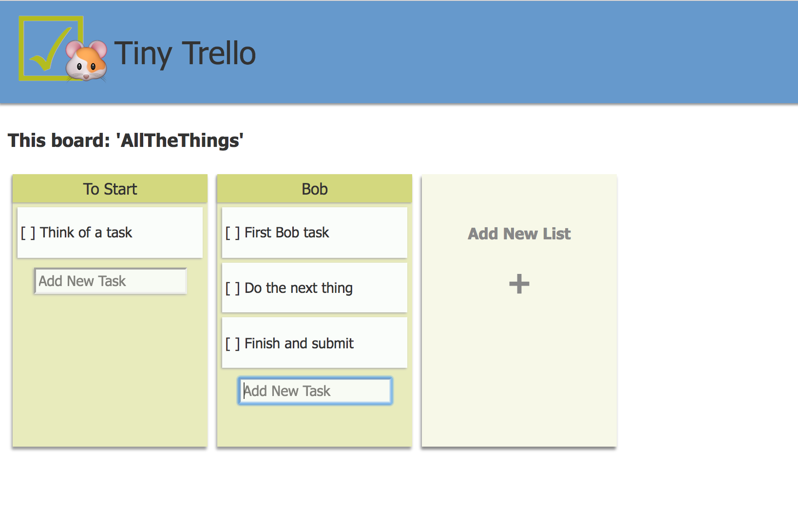

# 🐹 Tiny Trello
A simplified Trello clone with an adorable hamster mascot for your most ephemeral tasks.

## Prerequisites

You will need the following things properly installed on your computer.

* [Git](https://git-scm.com/)
* [Node.js](https://nodejs.org/) (with NPM)
* [Ember CLI](https://ember-cli.com/)

## Installation

* `git clone <repository-url>` this repository
* `cd tiny-trello`
* `npm install`

## Running / Development

* `ember serve`
* Visit your app at [http://localhost:4200](http://localhost:4200).
